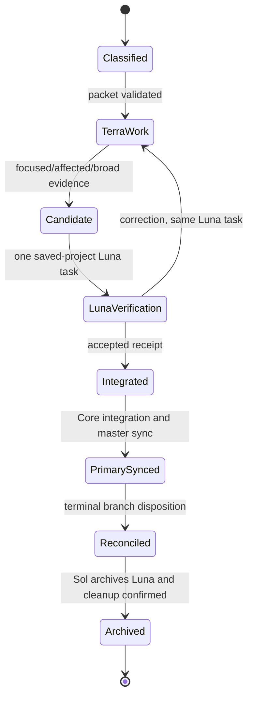
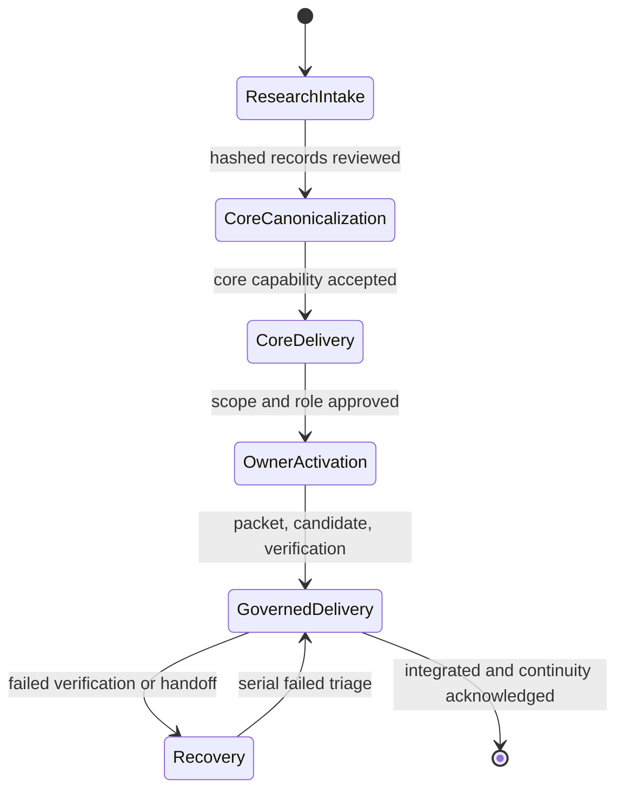

# Governed Codex Bootstrap

This repository is a clean-room starting point for a project that must retain evidence, make decisions explicitly, and deliver changes through reproducible controls. It is intentionally domain-neutral: replace the sample research with your own material before treating any canonical document as true.

Start with `docs/SYSTEM_USER_GUIDE.md` for the complete Codex-app, vault,
orchestration, continuity, closeout, and rehydration workflow. Then use the
practical vault guide at `Project_Obsidian_Vault/README.md`, open
`Project_Obsidian_Vault/00_Home/Project MOC.md`, and follow its research-first
links. Shared owner instructions live under
`Project_Obsidian_Vault/40_Coordination/Instructions/README.md`. Core vault
cleanup follows `docs/CORE_VAULT_MAINTENANCE_PROTOCOL.md`.

Optional external A2A critique is configured from `.env.example`. Copy it to
the ignored `.env`, install and authenticate only the provider CLIs you intend
to use, and keep credentials in provider or operating-system secret storage.
The complete setup, provider-choice, egress, and disposition workflow is in
`Project_Obsidian_Vault/40_Coordination/Instructions/External Critique Handoff.md`.

## Workflow substrate inventory

| Surface | Role |
| --- | --- |
| `tools/research_intake.py`, `research_organizer.py` | Preserve and map source evidence without promotion. |
| `tools/agent_work_selection_audit.py`, `agent_to_agent_plan_handoff.py` | Create frozen-baseline advisory selection and critique records; optionally capture an explicitly configured external-model response. |
| `tools/owner_scoped_orchestration.py` | Classify, bind, validate, and immutably record complete Sol/Terra/Luna packet and receipt lifecycles without model invocation. |
| `tools/test_runner.py`, `source_doc_audit.py`, `vault_maintainer.py` | Execute lifecycle tests, audit public source, and maintain safe navigation. |
| `tools/origin_reconciler.py`, `capability_status.py`, `export_agent_thread_continuity.py` | Report delivery facts, maturity evidence, and complete bounded continuity archives. |
| `tools/tool_parity.py`, `configs/tool_parity_v1.json` | Require an explicit complete counterpart, generic adaptation, or product-specific exclusion for every reference tool. |
| `configs/documentation_system_v1.json`, `docs/DOCUMENTATION_SYSTEM_PARITY.md` | Enforce substantive project-neutral equivalents for the instruction, Core bootstrap, continuity, Git, vault, and owner-workflow system. |
| `configs/` and `docs/` | Machine policy plus operational runbooks. |
| `assets/social/` | Editable social-diagram sources, X-ready exports, launch order, and accessibility text. |
| Folder-local `README.md` files | Explain each maintained directory, significant artifact, generated-content boundary, and change rule at the point of use. |

The initial social launch catalog is documented in
`assets/social/README.md`. Its SVG masters and PNG exports cover the six-plane
architecture, research-first promotion, owner-scoped orchestration, governed
PDF intake, test execution, portable continuity, and the X profile header.

The cold start is research intake and organization; Core canonicalization; advisory selection audit and plan handoff; user approval; Sol packet classification; Terra candidate; one reused saved-project Luna task through corrections; authorized integration; Core synchronization; continuity export; then Sol finalization/archive acknowledgment.

## Create a new role from Core

Core recognizes a demonstrated boundary; names stable and Git identities plus branch/worktree namespaces; records authority, non-ownership, scopes, public dependencies, and consumers; supplies role/bootstrap/profile/continuity/vault/feature/test assets; obtains owner adoption and activation evidence; integrates and marks the role active before its first task. A template is never dispatch authority.


## The six planes

| Plane | Purpose | Primary assets |
| --- | --- | --- |
| Authority | Who may decide and change what | `AGENTS.md`, `roles/`, owner registry |
| Canonical knowledge | Accepted, current project truth | `Project_Obsidian_Vault/00_Canonical/` and capability registry |
| Coordination | Requests, critique, work selection, handoffs | `coordination/` and work packets |
| Execution | Bounded implementation and verification | `tools/`, `tests/`, test policy |
| Delivery | Reviewable commits and safe integration | Git policy and reconciliation tool |
| Continuity | Bounded, attributable learning history | `continuity/` and transcript exporter |

Research is source-only material. It is immutable after intake and never becomes a contract merely by being present. Core is the only initially active owner and is responsible for turning reviewed research into the first canonical thesis, architecture, specification, and roadmap. Future owners remain inactive until Core explicitly activates their scope.

## Start from your research

1. Create a virtual environment and install development tools: `python -m pip install -e ".[dev]"`.
2. Copy each `.md`, `.txt`, or `.pdf` research file into `research/inbox/` and register it with `python tools/research_intake.py research/inbox/your-file.pdf --title "Short title" --origin "where it came from"`. Intake preserves exact bytes for all three formats.
3. Start the cold-path evidence lane with `python tools/research_organizer.py scan`, then `python tools/research_organizer.py build`. Markdown and plain text work with the base install. PDF organization uses the optional exact `pypdf==6.14.2` dependency and extracts native text in page order; it does not perform OCR or open encrypted files. Core must ask the user before downloading or installing it. After approval, install it with `python -m pip install -e ".[pdf]"`. A missing dependency is reported as unavailable rather than silently skipping the PDF.
4. Review candidates without deleting them: `python tools/research_organizer.py review candidate-id --status superseded --reason "..."`. Permitted statuses are `current`, `candidate`, `superseded`, `deadend_candidate`, `evidence`, and `source`. Dead-end and superseded candidates remain source material and cannot enter canonical documentation automatically.
5. Read the maintained vault from `Project_Obsidian_Vault/00_Home/Project MOC.md`: research first, then canonical and Core MOCs. Have the Core owner compare immutable records and review decisions, state uncertainties, and write only supported, explicitly accepted claims into `Project_Obsidian_Vault/00_Canonical/`.
6. Update `configs/capability_registry_v1.json` with the accepted capability state. Then activate a future owner only by changing the owner registry and adding its role, bootstrap, and continuity material.
7. Run `python tools/architecture_conformance.py`, focused tests, and finally `python tools/test_runner.py full` before an integration candidate is accepted.

## Authority hierarchy and canonical truth

The user supplies goals and approval. Core is the initial project authority: it owns initial canonical decisions, owner activation, primary-branch integration, and the continuity pack. An active owner may act only inside its recorded file and decision scope. Sol classifies risk and publishes packets; Terra executes the packet; Luna validates evidence. No lane gains authority merely by producing a useful answer.

Canonical documents have distinct responsibilities:

| Artifact | Responsibility |
| --- | --- |
| `THESIS.md` | Why the project exists and accepted governing claims |
| `ARCHITECTURE.md` | Stable components, boundaries, and six-plane relationships |
| `SPEC.md` | Observable behavior and non-negotiable contracts |
| `ROADMAP.md` | Ordered, authorized capability gates |
| capability registry | Machine-readable owner, state, evidence, and verification link |

Use capability states such as `proposed`, `active`, `verified`, `deferred`, `superseded`, and `retired`. A source record, organizer candidate, A2A discussion, test result, or transcript is evidence; none changes canonical truth without an explicit Core disposition. The promotion boundary is deliberately human: a candidate needs separate review, an accepted decision, canonical wording, and a verification witness.

## Core cold start and planning discipline

Core begins with no inferred domain doctrine. It verifies the bootstrap, organizes research, identifies agreement and uncertainty, records an assumption ledger, and writes the minimum supported canonical baseline. Every substantial plan freezes its decision evidence at the initial inspected state: distinguish selection evidence (canonical ordering, contract, ownership, prerequisites, tests) from later delivery conditions (unrelated worktree changes or navigation drift). Reopen a conclusion only when the selected item or its material prerequisite changes.

Publish agent-to-agent material under `coordination/` as a bounded record. A critique begins by listing common agreement, all disagreements, weak points, a convergence move, and decision status. Each substantive critique point receives a disposition: accepted, partly accepted, rejected, deferred, or requires user approval. A2A records preserve convergence history; Core alone promotes accepted conclusions to canonical documents.

The complete Core rehydration prompt is
`Project_Obsidian_Vault/30_Core/Core Bootstrap.md`. Its continuity MOC links
separate reorientation, assumption-audit, canonical/runtime reconciliation,
and continuity-maintenance protocols. This prevents the common failure where a
short bootstrap pointer exists but does not contain enough authority order,
evidence order, owner boundaries, recovery, and closeout detail to restart the
system safely.

## Risk, packet, and delivery state machine

Sol assigns `low`, `standard`, or `high` risk deterministically. Public contracts, persistence, security, migration, legal/release, mathematics, cross-owner boundaries, and full-suite changes should escalate rather than silently downgrade. A packet contains a packet identity, implementation-cycle identity, owner, risk, bounded scope, required checks, assumptions, and acceptance conditions. The receipt cryptographically binds the packet hash; a Luna receipt also binds the exact candidate commit.



Branch dispositions are `landed`, `superseded`, or `awaiting_named_integrator`; only the first two are terminal. Before integration, inspect Git state and stage only task-owned files. Core checks a clean primary checkout and requires local primary to equal `origin/master` after integration. `origin` is intentionally absent in a newly created local bootstrap: `affected --base origin/master` and `sync-main` fail closed until a remote is explicitly configured. They never compensate by guessing a comparison branch.

## Continuity and owner activation

One thread belongs to one owning continuity pack. Core uses `tools/export_agent_thread_continuity.py` to retain a stable full-line source prefix, exact safe user/assistant records, credential-redacted exceptions, display-safe Markdown parts, chronological MOCs, source and selected-record hashes, and a post-navigation output inventory. It never reconstructs unavailable source history from summaries. Terra and Luna emit bounded receipts into Core's pack; they do not become separate continuity owners. Follow `docs/AGENT_CONTINUITY_EXPORT.md` for the dry-run, apply, navigation, manifest-refresh, and idempotence sequence.

To create a future owner, Core must accept the boundary, add a role and bootstrap document, create its continuity root, assign scoped registry authority, add packet/check policy, and update tests. An inactive template is not permission to edit or decide.

## Recovery and definition of complete

Functional recovery assets reproduce behavior: pinned development artifacts, runnable tools, tests, impact maps, and deterministic packets. State-equivalent recovery assets reproduce traceability: content-hashed research records, packet and receipt hashes, Git inspection reports, branch dispositions, and transcript export metadata. Keep both; neither replaces the other.

A change is complete only when its packet scope is satisfied, focused and broader checks pass (including exactly one final full run where required), Luna's accepted reused-task receipt binds the final candidate, the change is committed/pushed/integrated by the authorized owner, primary synchronization and terminal reconciliation pass, worktree cleanup is confirmed, and continuity closeout is exported. A failed full run returns to serial `failed` triage before another candidate; it is not a reason to loop parallel workers.

## Lifecycle



The state order is enforced by the repository conformance test: research must exist before canonicalization, and no non-Core owner can be active in the initial bootstrap.

## Operational workflow

1. **Sol** deterministically classifies change risk and creates a work packet.
2. **Terra** performs bounded tracked work, runs focused/failed/affected/broad checks, and makes a local candidate commit.
3. **Luna** validates that exact candidate once per implementation cycle and reuses that same task for every correction/reverification. It must be created inside the saved project (a projectless task is invalid). Its receipt binds the candidate and project/task identity; it is never an archive acknowledgment. It never commits or integrates.
4. A failed full run returns to serial failed triage; it does not repeatedly launch the parallel suite.
5. Sol creates the separate subordinate archive/finalization acknowledgment only after an accepted exact-candidate receipt, no correction pending, commit/push/integration, primary-branch synchronization, terminal reconciliation, and worktree cleanup. Failed, blocked, and user-input-needed tasks remain visible. Core performs the bounded integration check and exports the owning continuity transcript.

`tools/owner_scoped_orchestration.py` validates packets, exact lane bindings,
candidate receipts, runner bindings, correction cycles, and immutable receipt
bundles. `tools/origin_reconciler.py` reports bounded reconciliation facts and,
for Core only, may fetch/prune and fast-forward the clean primary checkout with
`merge --ff-only`; it never infers integration authority, resets, rebases, or
deletes.

## Test profiles

```text
python tools/test_runner.py focused tests/test_conformance.py
python tools/test_runner.py failed
python tools/test_runner.py affected --base origin/master
python tools/test_runner.py broad
python tools/test_runner.py full
```

The impact map is fail-closed: an unknown runtime source change chooses the broad boundary. Full runs parallel-safe tests with at most four workers and then runs exclusive tests serially. Fixed ports, real repositories, shared services, process-wide environment mutation, and shared stores belong to the serial phase.

## Clean-room build order and recovery assets

Create a project in this exact order: root policy and six-plane directories;
the maintained vault and its narrative MOCs; source-preserving research
inbox/records/schema; research organizer and tests; empty vault canonical
templates and capability registry; Core role/bootstrap/continuity roots;
owner, orchestration, Git, testing, vault-maintenance, tool-parity, and
conformance configurations; complete coordination, packet, reconciliation,
continuity, source-documentation, vault, and test-runner tools; future-owner
inactive scaffold; third-party artifact records; then the self-conformance
test. Recovery is supported by immutable research records, hashed work packets
and receipts, bounded transcript exports, Git inspection reports, pytest
last-failure cache under `tmp/`, and the serial isolation suite. No remote is
assumed by this bootstrap.

## Reference-tool dispositions

The bootstrap deliberately does not copy product runtime utilities. See
`docs/TOOL_PARITY.md` for the distinction between complete generic equivalents,
generic adaptations, explicit product-specific exclusions, and bootstrap-native
tools. Run `python tools/tool_parity.py` whenever the tool inventory changes.

The same rule applies to instructions and maintained Markdown. See
`docs/DOCUMENTATION_SYSTEM_PARITY.md`; conformance rejects missing operational
surfaces, skeletal replacements, incomplete Core continuity protocols, and
project-specific reference markers.

Run the complete initial verification with:

```text
python -m pytest
python tools/architecture_conformance.py
python tools/test_runner.py full
```
