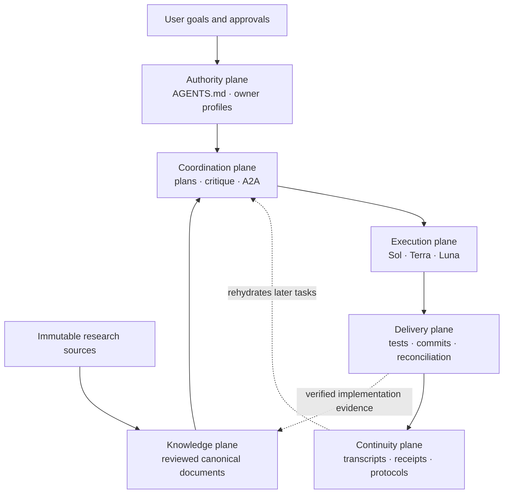
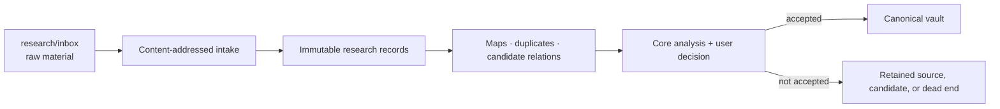
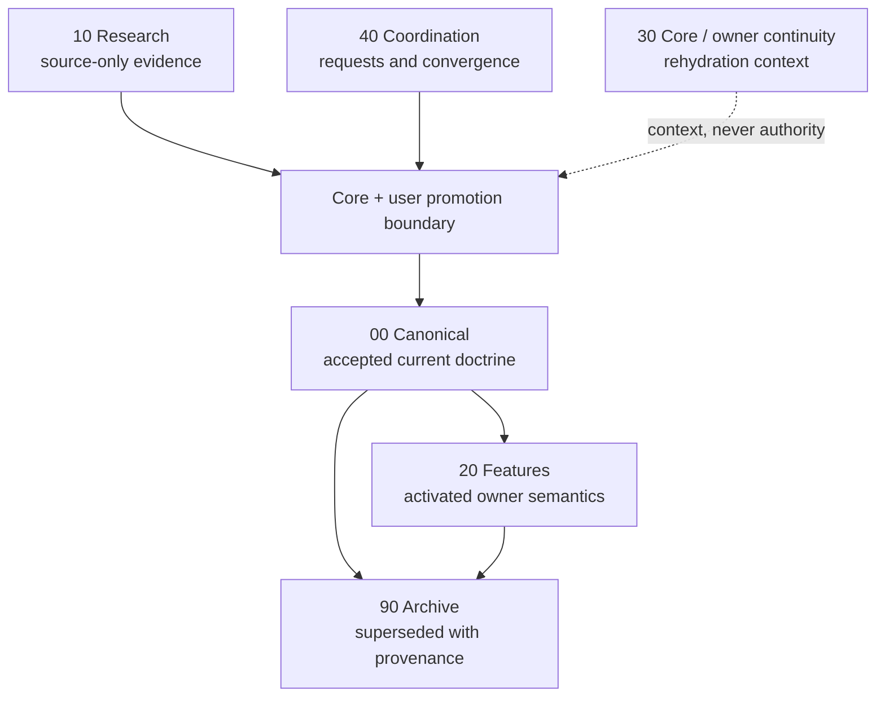
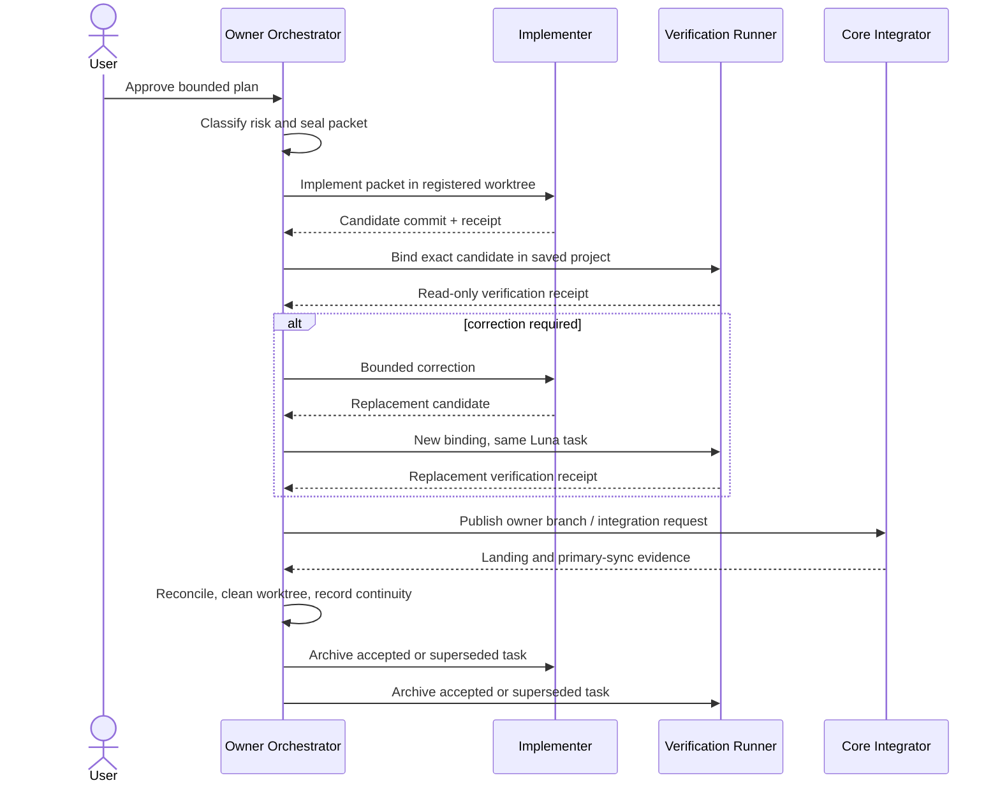
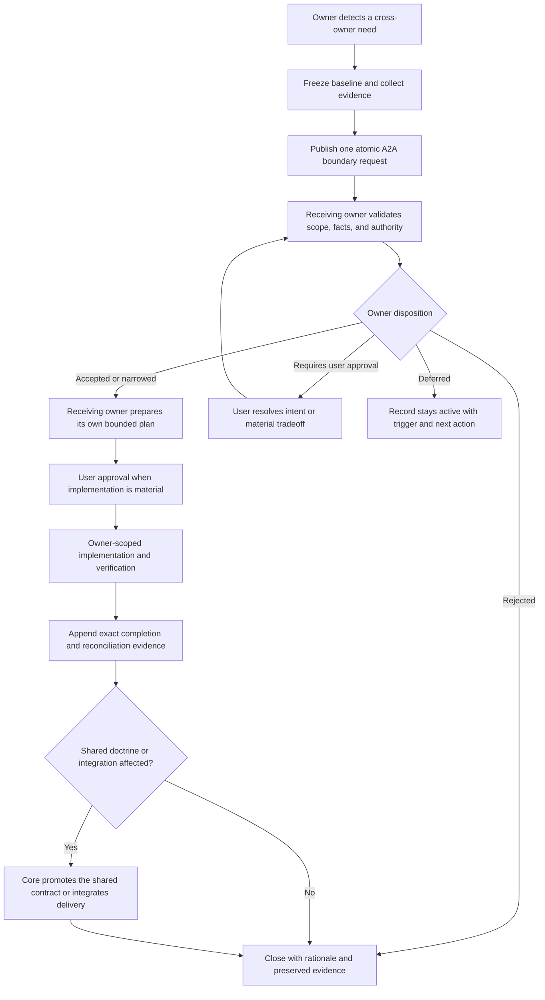
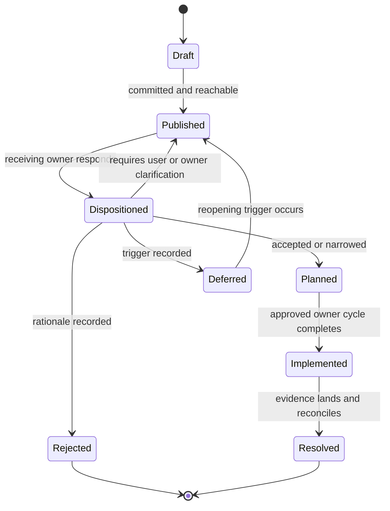
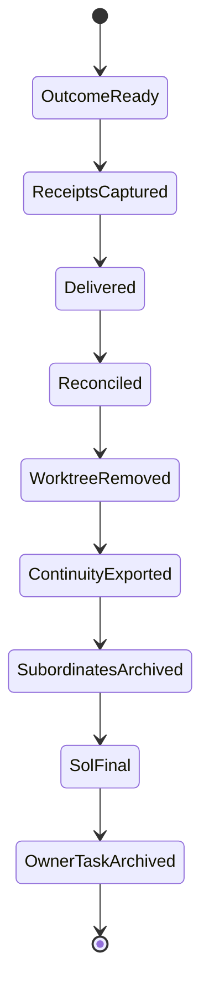

# Governed Project System User Guide

This guide explains how to operate the complete development-governance system
from the Codex desktop app. It is written for a project that begins with
research, has only Core active, and later grows into separately owned product
or domain areas.

The system is not a plugin, an autonomous manager, or a substitute for user
judgment. It is a repository-native operating system made from Markdown, Git,
machine-readable policy, deterministic tools, tests, and owner-scoped Codex
tasks.

## The System In One View

Six planes keep authority, knowledge, work, delivery, and memory from being
collapsed into one chat transcript.



The six planes answer different questions:

| Plane | Question | Main artifacts |
| --- | --- | --- |
| Authority | Who may decide or change this? | `AGENTS.md`, owner registry, role profiles |
| Knowledge | What is currently accepted? | Thesis, Architecture, Spec, Roadmap, capability registry |
| Coordination | What is proposed, disputed, or waiting? | plans, work-selection audits, A2A records |
| Execution | Who plans, implements, and independently checks? | Sol/Terra/Luna packets and receipts |
| Delivery | Did the exact change pass and land safely? | tests, Git commits, reconciliation evidence |
| Continuity | How can a fresh task recover the important history? | bounded transcripts, curated protocols, receipt links |

No plane silently grants authority to another. A research note is not a
decision. A passing test is not product approval. A useful chat answer is not
canonical documentation. A pushed branch is not integrated delivery.

## Start In The Codex Desktop App

The current Codex app supports local projects connected to folders. The
project's primary folder is the default working directory for Git and for
discovering repository `AGENTS.md` instructions. See the official
[Projects and chats guide](https://learn.chatgpt.com/docs/projects) and
[Codex app quickstart](https://learn.chatgpt.com/docs/quickstart?setup=app).

### First opening

1. Install Git and Python. Install Node.js if the project will need JavaScript
   or frontend tooling.
2. Open Codex and create or edit a local project.
3. Add the repository root as a folder and make it the **primary** folder.
4. Start the task from that saved project, not from a projectless chat. A task
   outside the project may not receive the repository root, `AGENTS.md`, Git
   context, or expected worktree environment.
5. Use the local checkout for Core reorientation and planning. Use a
   repository-local `.worktrees/<owner>-<slice>` checkout for implementation
   when the approved packet requires isolation.
6. Confirm the terminal is at the repository root and run:

   ```powershell
   git status --short --untracked-files=all --ignore-submodules=all
   python tools/architecture_conformance.py
   ```

7. Open `Project_Obsidian_Vault/00_Home/Project MOC.md` in Obsidian or a
   Markdown viewer. Obsidian is the preferred human navigation surface, while
   the files remain ordinary Git-versioned Markdown.

### Codex capability and plugin preflight

No Codex plugin is required for the initial bootstrap. The system is built on
native Codex and repository capabilities:

| Native capability | When required |
| --- | --- |
| Saved local project with the repository as primary folder | Cold start and every owner task |
| Repository `AGENTS.md` discovery | Cold start and every owner task |
| Git and repository-local worktrees | Implementation and delivery |
| Sol / `xhigh` owner binding | Owner orchestration |
| Terra / `high` binding | Any tier that uses the Implementer |
| Luna / `max` binding | Full-team verification |
| Saved-project subordinate-task coordination | Delegated implementation and reverification |
| Subordinate-task archival | Successful orchestration closeout |

The first Core task reads `configs/codex_bootstrap_v1.json` and reports which
capabilities are available. A missing capability blocks only the lifecycle
stage that requires it; it is never silently replaced by a plugin or different
model.

Inspect plugins from **Codex > Plugins > Installed** or, when the Codex CLI is
available:

```powershell
codex plugin list --json
```

The initial plugin set is intentionally empty. Plugins can bundle skills,
connectors, MCP tools, hooks, and other capabilities, so installing one may
change both workflow and data-access boundaries. Installation therefore needs
an explicit purpose and user approval. Connector authentication and action
permissions remain separate decisions.

| Optional plugin | Add only when |
| --- | --- |
| GitHub | The approved workflow needs GitHub issues, pull requests, or remote repository data beyond local Git |
| OpenAI Developers | The project builds against OpenAI products or needs current official developer documentation |
| Codex Security | The user authorizes a bounded security scan or remediation workflow |
| Zotero | Authorized research lives in a Zotero library rather than local intake files |
| Browser | Interactive website inspection or browser acceptance testing is required |
| Source-system connector | A named owner approves access to a particular document, messaging, or project system |

Sol Advisor is not required or installed. This repository implements its own
owner-scoped orchestration policy, prompts, packets, receipts, tests, and
closeout lifecycle.

### First Core task

Start one clearly named Core task and use this prompt:

```text
You are the Core Owner for this governed project. Read AGENTS.md,
roles/core/ROLE.md, roles/core/BOOTSTRAP.md, and the complete Core Bootstrap
prompt in Project_Obsidian_Vault/30_Core/Core Bootstrap.md. Rehydrate from
current repository evidence. Report the current baseline, evidence inspected,
continuity freshness, Codex native-capability and plugin preflight, assumptions,
owner boundaries, and the smallest next Core-owned step. Do not implement until
I approve a plan.
```

The task should first report what it found. It should not infer product truth
from the template or treat sample research as accepted doctrine.

### Bring in your research

Put source material in `research/inbox/` and register it rather than copying
claims directly into canonical documents:

```powershell
python tools/research_intake.py research/inbox/example.md --title "Example" --origin "Source description"
python tools/research_organizer.py scan
python tools/research_organizer.py build
```

Review the source map and candidate relationships. Core then proposes the
minimum supported Thesis, Architecture, Spec, Roadmap, and capability state.
The user approves promotion; the organizer never promotes material by itself.



## The Vault And The LLM Wiki Pattern

The vault adapts Andrej Karpathy's
[LLM Wiki pattern](https://gist.github.com/karpathy/442a6bf555914893e9891c11519de94f):
immutable raw sources, an interlinked Markdown knowledge layer, and a schema
that tells the agent how to maintain it. The original pattern emphasizes a
persistent, compounding wiki instead of re-deriving every synthesis from raw
documents for every question.

This system deliberately adds governance that a personal wiki does not need.

| LLM Wiki idea | Governed adaptation |
| --- | --- |
| Raw sources are immutable | Research intake preserves source identity, hashes, provenance, and review state |
| The LLM maintains a wiki | Owners maintain bounded narrative areas; generated navigation is tool-owned |
| One schema instructs the LLM | Root policy, owner profiles, machine configuration, and conformance tests divide responsibilities |
| Ingest updates the wiki | Intake creates source records; promotion to canonical knowledge requires Core and user disposition |
| Query uses compiled pages | Tasks read MOCs first, then only the relevant canonical, research, coordination, or continuity notes |
| Lint finds stale or orphaned pages | Vault checks enforce parentage, links, breadcrumbs, size diagnostics, and idempotent navigation |
| Index and log support navigation | Narrative MOCs provide meaning; immutable receipts and records preserve chronology |

The most important departure is that the agent does **not** own every vault
page. Canonical documents have explicit promotion authority. Feature areas
belong to activated owners. Coordination and continuity retain useful history
without becoming truth merely because an agent wrote them.



Obsidian is useful because MOCs, backlinks, and graph navigation expose the
shape of the system to a person. Obsidian is not the database of record and no
plugin is required for correctness. Git stores the files; conformance tools
validate their structure; owner decisions supply their meaning.

## Owner-Scoped Orchestration

Every active owner receives a logical development team:

| Lane | Binding | Job |
| --- | --- | --- |
| Owner Orchestrator | Sol / `xhigh` | Rehydrate, plan, protect authority, review, publish, integrate when Core, and close continuity |
| Implementer | Terra / `high` | Make one packet-bounded candidate commit and run focused checks |
| Verification Runner | Luna / `max` | Independently verify the exact candidate without repository writes |

This is related to the advisor/worker pattern demonstrated by
[Sol Advisor](https://sol-advisor.space/getting-started.html), which uses a
primary Sol task and companion implementation or Luna task lanes. This
bootstrap does not install, copy, or depend on that plugin.

Its application is intentionally different:

| Advisor pattern | This repository's application |
| --- | --- |
| Plugin supplies orchestration behavior | Repository policy, prompts, configuration, and tests define behavior locally |
| A primary advisor delegates implementation | Each separately activated owner has its own Sol authority boundary |
| Native and Luna lanes are alternative routes | Terra implements; Luna independently verifies the exact candidate |
| Lane availability drives routing | Risk classification and exact model bindings are fail-closed |
| The primary task reviews a worker | Sol must validate immutable packet/receipt hashes and exact commit identity |
| Completion is primarily task-level | Completion also requires tests, publication, integration, primary sync, reconciliation, worktree cleanup, continuity, and archive acknowledgment |

The shared prompt templates live in `roles/shared/`. They provide lane
behavior but grant no ownership. The owner profile and immutable work packet
supply the exact authority, paths, tests, and candidate identity.



Sol remains the only user-facing lane. Terra cannot push or expand scope.
Luna cannot edit, commit, push, integrate, delete, or archive itself. A failed,
blocked, or user-input-needed subordinate task remains visible.

## Agent-To-Agent Discussions And Owner Direction

Agent-to-agent (A2A) coordination is the typed boundary between independently
owned areas. It is how one owner requests a public contract, evidence,
disposition, or integration action without taking over the other owner's
files or decisions.

A2A is used for:

- cross-owner boundary and public-contract requests;
- implementation-plan critique and disagreement convergence;
- owner responses and explicit dispositions;
- exact branch and integration handoffs;
- work-selection audits and completion evidence.

It is not a shared implementation sandbox, an informal permission grant, or a
way for one owner to direct another owner's private design. A published A2A
record is source evidence. It becomes actionable only through the responsible
owner's disposition and any user approval required by the proposed change.

### Who decides the direction

| Participant | Decides | Does not decide |
| --- | --- | --- |
| User | Project intent, material tradeoffs, plan approval, and authority expansions | The implementation details delegated to an owner unless the user chooses to constrain them |
| Requesting owner | Its consumer need, observed gap, required public behavior, evidence, and acceptance conditions | How the receiving owner must implement its private internals |
| Receiving owner | Meaning, design, sequencing, and disposition inside its activated scope | Another owner's semantics or a change to user intent |
| Core | Shared contracts, canonical promotion, owner activation, architecture-wide constraints, primary-branch integration | A feature owner's private semantics, legal conclusion, audit judgment, or user-facing design merely to avoid a handoff |
| Review or critique role | Weak assumptions, disagreements, risks, and a convergence proposal | Acceptance, implementation, promotion, or certification |
| Terra and Luna | Packet-bounded implementation evidence and independent verification evidence | Scope, authority, owner direction, or publication |

The requesting owner should say **what public outcome it needs and why**. The
receiving owner decides **whether and how its owned surface should provide
that outcome**. It may accept, narrow, reject, defer, or identify a user
decision. Core may reject a proposed shared boundary that violates repository
architecture, but it cannot manufacture the missing domain decision itself.

When no active owner has the required authority, the work does not silently
fall to Core or the nearest feature. Core and the user first recognize and
activate a new owner through `docs/ROLE_BOOTSTRAP_AND_ACTIVATION.md`.

### Evidence and decision order

Each owner re-evaluates the request against current evidence. A useful order
is:

1. latest explicit user instruction and approval;
2. current canonical Thesis, Architecture, Spec, and Roadmap;
3. current source, tests, configuration, public contracts, and receipts;
4. accepted A2A dispositions within their recorded scope;
5. research and continuity as non-authoritative context.

The owner records which assumptions are verified, invalidated, unverified, or
dependent on another owner. A past transcript, forceful critique, or apparently
complete proposal never outranks current repository evidence.



### What an atomic boundary request contains

A request should be small enough that the receiving owner can disposition it
without reconstructing an entire chat. Record:

- requesting owner, receiving owner, and exact request type;
- frozen source or commit baseline;
- observed gap and why it belongs across an owner boundary;
- the public result, contract, evidence, or decision being requested;
- known consumers and observable acceptance conditions;
- exact supporting files, symbols, tests, receipts, or external sources;
- explicit non-ownership and prohibited assumptions;
- current disposition, next responsible owner, and reopening condition;
- completion branch, commits, integration target, and reconciliation evidence
  when implementation follows.

Do not include credentials, private reasoning, another owner's full transcript,
or a prescribed private implementation. Cross-owner context links to the
owning evidence instead of copying it into a second continuity pack.

### Critique must converge

Plan critique is a special A2A record. It uses the five-part shape maintained
by the coordination instruction hub:

1. Common Agreement
2. All Remaining Disagreements
3. Critical Weak Points
4. Convergence Move
5. Decision Status

List all known disagreements rather than revealing new objections after each
round. A useful iteration removes or narrows at least one disagreement. The
owning agent dispositions every substantive point as `Accepted`, `Partially
accepted`, `Rejected`, `Deferred`, or `Requires user approval`. Strong words
from a review model do not make a point binding.

Create an immutable plan-critique handoff with:

```powershell
python tools/agent_to_agent_plan_handoff.py --topic "<topic>" --plan-file <path> --owner <owner> --apply
```

`tools/agent_to_agent_handoff.py` is the compatibility alias. Boundary
requests and owner responses live as separate atomic coordination records;
do not disguise a public-contract request as a plan critique.

### A2A lifecycle and unresolved work



`Accepted` means the owner accepts the direction; it does not claim the code
exists. `Implemented` means evidence exists; it does not claim the branch is
landed. `Resolved` requires the exact completion evidence and any required
Core integration. A deferred request stays visible with a named trigger.

An integration handoff is narrower still. `awaiting_named_integrator` routes a
published branch to Core, but it is a blocker rather than a terminal branch
state. Core inspects the owner-authored disposition before integrating or
superseding anything. Inbox membership is evidence requiring a decision, not
automatic merge authority.

### Practical boundary examples

- A feature needs a new shared repository port. It requests the observable
  contract from Core rather than creating a feature-local substitute.
- A presentation owner needs a reference-safe status view. It states the
  display need; the producing owner decides which public projection is safe.
- Audit needs replay-stable evidence. It requests a public receipt from the
  producing owner rather than reading that owner's private persistence state.
- Core needs a third-party licensing disposition. It supplies exact artifact
  evidence to the legal owner and does not infer the legal conclusion itself.

Start with
`Project_Obsidian_Vault/40_Coordination/Agent-to-Agent Discussions MOC.md`,
then read the active-record index and only the records relevant to the current
boundary. The coordination area preserves how a decision converged; accepted
shared direction is promoted separately into canonical documents by the
authorized owner.

## One Complete Work Cycle

### Discovery and planning

1. Sol reads current evidence and freezes the planning baseline.
2. Sol classifies verified, invalidated, unverified, and owner-dependent
   assumptions.
3. Sol identifies the smallest owned and unblocked step.
4. Work-selection and critique records remain advisory.
5. Sol presents a plan and waits for explicit user approval.

### Implementation and verification

1. Sol creates the immutable packet after approval.
2. Terra changes only authorized paths and creates one local candidate commit.
3. Terra runs focused, failed, affected, and broad test profiles as assigned.
4. Sol reviews the diff and receipt.
5. Luna runs the final exact-candidate verification once. A correction reuses
   the same Luna task with a new candidate binding.
6. Sol publishes only after acceptance. Core alone integrates the primary
   branch.

### Integrated closeout

Documentation, A2A dispositions, capability evidence, Git delivery,
continuity, and subordinate archival are part of the implementation cycle.
They are not separate roadmap gates and should not consume an extra user turn
unless a genuine blocker exists.

## Close A Task Promptly And Rehydrate Correctly

Long-running chats accumulate stale assumptions and make ownership harder to
see. Close a task after one distinct outcome is delivered, but never archive
it before its durable evidence is captured.

### Ask Sol to close the cycle

Use this prompt when the requested outcome is complete:

```text
Close this implementation cycle now. Do not select the next roadmap step.
Complete scoped verification, commit/publication, terminal reconciliation,
primary synchronization when Core, worktree cleanup, bounded continuity
export, vault navigation and manifest verification, finalization evidence,
and archival of accepted or superseded Terra/Luna tasks. Report any genuine
blocker instead of calling the cycle complete.
```

Sol should then produce a final summary containing the exact commit or branch,
checks, reconciliation state, worktree disposition, continuity result, and any
remaining owner action.

### Archive only after durable closeout

The order is strict:



After Sol reports successful closeout, archive the finished owner task from
the Codex project. The official app guidance recommends archiving completed
chats and allows restoration from **Settings > Archived chats**. Archival is
sidebar hygiene, not continuity: the repository continuity pack is what lets a
new task reconstruct the decision context.

Do not archive when:

- a correction is pending;
- a task is failed, blocked, or waiting for user input;
- commits are unpushed or awaiting unnamed integration;
- primary synchronization or worktree cleanup failed;
- the exact transcript source was unavailable;
- continuity or archive acknowledgment is incomplete.

### Rehydrate in a fresh task

1. Start a new task inside the same saved Codex project.
2. Use the Core Bootstrap prompt at
   `Project_Obsidian_Vault/30_Core/Core Bootstrap.md`.
3. Tell Core which outcome or next decision you want. Do not paste the entire
   old chat.
4. Core reads the continuity MOC and only relevant transcript sections.
5. Core verifies every material claim against current canonical documents,
   source, tests, configuration, A2A, receipts, and Git history.
6. Core reports freshness and discrepancies before planning new work.

Continuity is a recovery index, not model memory and not authority. A new task
is expected to disagree with an old transcript when the repository has moved
on.

## What Is Unique Here

The pieces are familiar; their composition is unusual.

| Unique composition | Intended effect |
| --- | --- |
| Research-first cold start with no inferred product doctrine | Prevent a polished template from pretending it already knows the project |
| Compiled Markdown vault plus explicit authority layers | Preserve the usefulness of an LLM wiki without letting generated synthesis self-promote |
| Only Core active initially | Force ownership boundaries to be demonstrated before specialization |
| One Sol/Terra/Luna team per owner | Scale implementation without losing semantic or publication authority |
| Exact, immutable packets and receipts | Make scope, model, candidate, checks, and outcomes replayable and mismatch-resistant |
| Read-only independent Runner | Separate creation from verification and prevent the verifier from repairing its own evidence |
| A2A convergence records with explicit dispositions | Preserve disagreement while forcing decisions to become narrower over time |
| Impact-mapped testing plus one final parallel-safe run | Keep iteration fast without weakening final evidence |
| Core-only primary integration and mandatory reconciliation | Stop branches and local primary state from silently diverging |
| One task ID per owner continuity pack | Preserve attribution and prevent duplicate or cross-owner memory |
| Sol-owned archive acknowledgment after delivery | Prevent completed subordinate tasks from stacking up or disappearing before evidence capture |
| Functional and state-equivalent recovery assets | Reproduce both behavior and the provenance needed to understand it |

The architecture treats the repository as the durable coordination medium.
Agents are replaceable processes. Chats are temporary working contexts. The
files, hashes, tests, receipts, ownership records, and Git history are the
recoverable system.

## How The Architecture Is Opinionated

The bootstrap makes deliberate choices rather than supporting every possible
workflow.

### It prefers evidence over conversational convenience

Important decisions must become reviewed files, tests, or receipts. Chat alone
is insufficient. This adds closeout work but makes context loss survivable.

### It requires executable mathematical evidence

Numerical and algebraic claims cannot come from memory or mental arithmetic.
Use SymPy for exact symbolic constants, identities, rational comparisons, and
exponents. Use NumPy for the finite floating-point behavior the project
actually executes. Every material claim cites an executable witness,
repository constant, or test result. If the required tool or runtime evidence
is unavailable, the claim remains unverified rather than being estimated.

### It separates knowledge levels

Research, candidate interpretation, accepted doctrine, implemented behavior,
and historical continuity are different states. Promotion is explicit and
human-governed. This is slower than allowing an agent to continuously rewrite
one wiki, but safer for shared or high-stakes work.

### It prefers bounded ownership over a universal super-agent

Core owns shared policy and integration, not every feature's meaning. New
owners are inactive until their dependencies and non-ownership are explicit.
This creates coordination overhead in exchange for preventing silent
cross-domain rewrites.

### It prefers fail-closed orchestration

Missing model bindings, prompts, project context, exact candidate identity,
test evidence, or reconciliation do not silently degrade. The cycle reports a
blocker. This can stop work that a looser system would attempt, but it keeps
the evidence honest.

### It prefers one complete cycle over partial delivery

Implementation includes documentation, tests, integration evidence,
continuity, and cleanup. A branch push is not success. This is intentionally
stricter than ordinary prototype development.

### It prefers visible local artifacts over hidden memory

The vault, configuration, receipts, and transcripts are inspectable and
versioned. They can be audited without trusting one model instance. The cost
is more repository structure and maintenance.

### It preserves failed and superseded reasoning

Rejected candidates and old doctrine are archived with provenance rather than
silently erased. This costs storage and requires good MOCs, but prevents the
same dead end from being rediscovered without context.

## When To Simplify

For a one-person throwaway experiment, the full system may be excessive. Keep
the research/source boundary, root policy, focused tests, Git safety, and a
minimal continuity note; activate additional owners and full-team
orchestration only when the project develops real semantic boundaries or
delivery risk.

Do not simplify by collapsing source into truth, allowing the verifier to edit
the candidate, sharing one continuity archive across owners, or letting every
agent integrate the primary branch. Those choices remove the controls that
make the architecture recoverable.

## Daily Operator Checklist

### Start

- Open the repository as the primary folder of a saved Codex project.
- Start one task for one outcome.
- Rehydrate from `AGENTS.md`, the owner bootstrap, continuity MOC, current
  canonical documents, and live Git evidence.
- Check pending integration and owner requests before selecting new work.

### Work

- Freeze the planning baseline.
- Inspect relevant A2A requests and state every owner-dependent decision.
- Ask for explicit plan approval before mutation.
- Use the required Sol/Terra/Luna tier.
- Use SymPy and NumPy witnesses for material mathematical claims; never rely
  on mental arithmetic.
- Keep temporary artifacts under `tmp/` and implementation worktrees under
  `.worktrees/`.
- Iterate with focused testing; reserve the full profile for the final
  candidate.

### Finish

- Prove the exact candidate and required checks.
- Publish owner dispositions and completion evidence for every A2A touched by
  the cycle.
- Publish and integrate through the authorized owner.
- Synchronize and reconcile Git.
- Remove verified-clean temporary worktrees.
- Export bounded continuity and verify vault navigation.
- Record finalization and archive accepted/superseded subordinate tasks.
- Read Sol's final summary, then archive the completed owner task.

### Resume later

- Start a fresh task inside the same project.
- Use the complete owner bootstrap prompt.
- Let continuity locate history, then verify it against current repository
  evidence.
- Continue only after the rehydration report identifies freshness, assumptions,
  and unresolved ownership.
