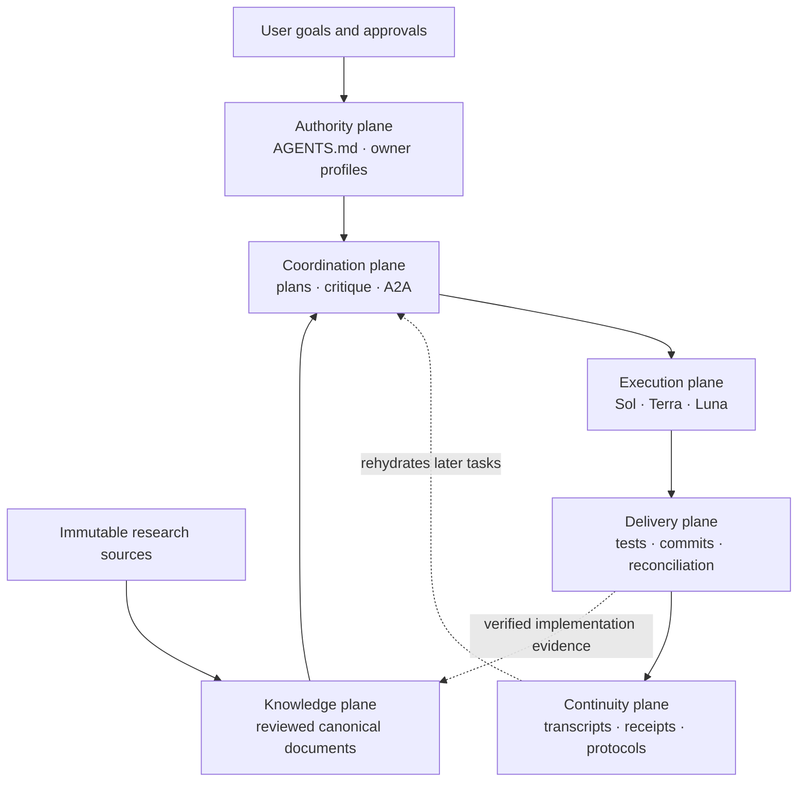
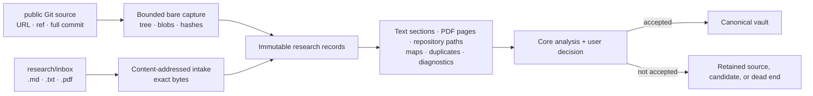
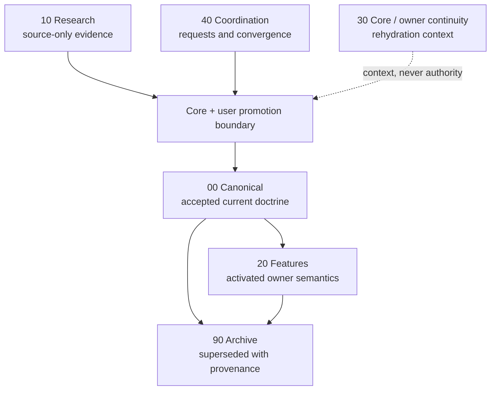
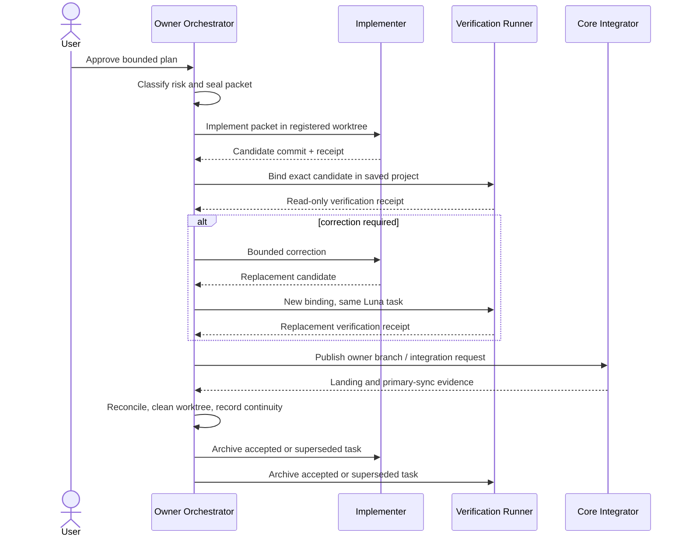
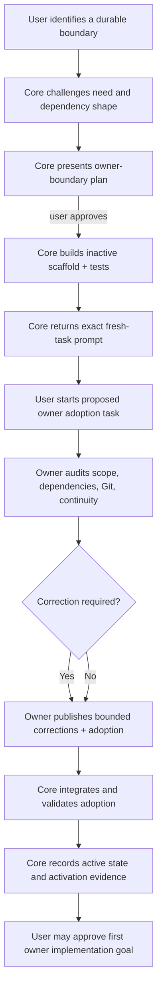
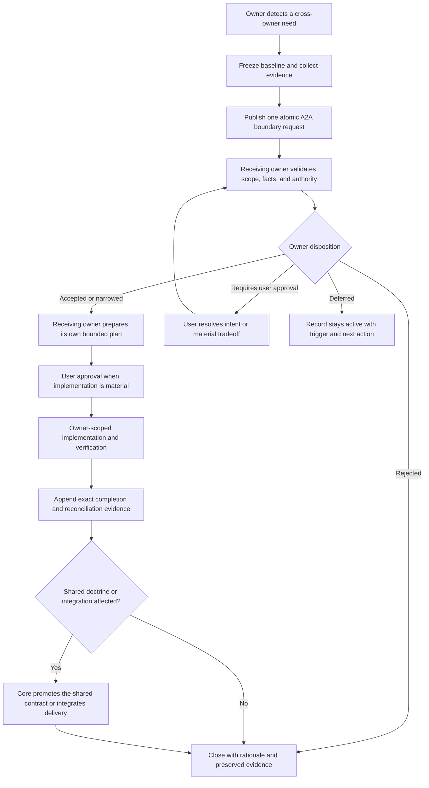
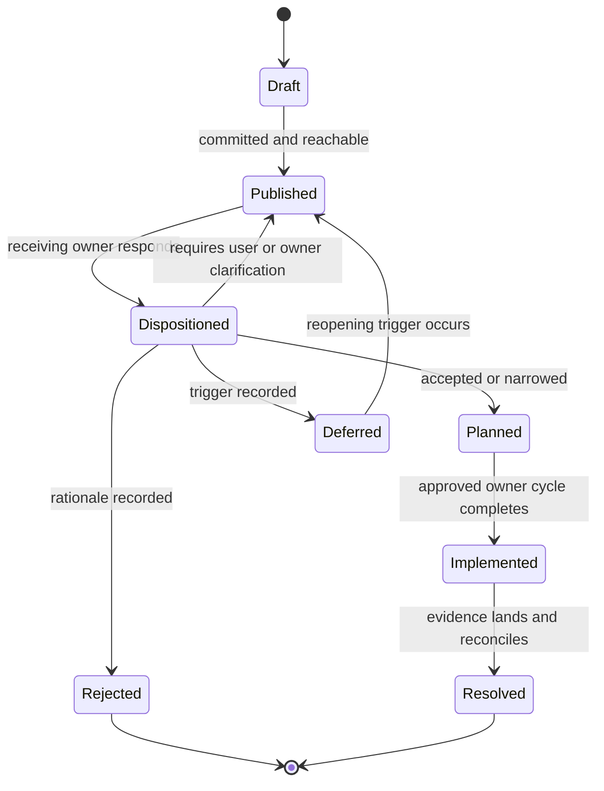
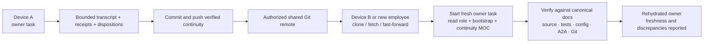
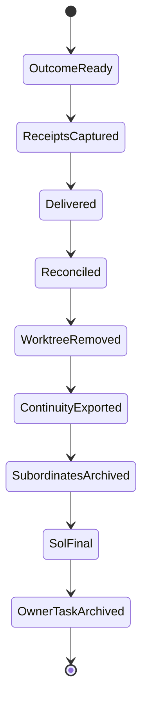

# Governed Project System User Guide

This guide explains how to operate the complete development-governance system
from the Codex desktop app. It is written for a project that begins with
research, has only Core active, and later grows into separately owned product
or domain areas.

The system is not a plugin, an autonomous manager, or a substitute for user
judgment. It is a repository-native operating system made from Markdown, Git,
machine-readable policy, deterministic tools, tests, and owner-scoped Codex
tasks.

### Guide map

Read the guide in order on first setup. Return directly to the relevant
section during daily operation.

| Section | Concise purpose |
| --- | --- |
| [The System In One View](#the-system-in-one-view) | Introduces the six planes and the authority separations that hold the system together. |
| [Start In The Codex Desktop App](#start-in-the-codex-desktop-app) | Opens the repository correctly, verifies Codex capabilities, starts Core, and imports initial research. |
| [The Vault And The LLM Wiki Pattern](#the-vault-and-the-llm-wiki-pattern) | Explains how source, canonical knowledge, coordination, continuity, and archives remain distinct but navigable. |
| [Owner-Scoped Orchestration](#owner-scoped-orchestration) | Defines the Sol, Terra, and Luna lanes and their immutable packet, verification, and archival boundaries. |
| [Create And Activate A New Owner](#create-and-activate-a-new-owner) | Shows when a separate owner is justified, what Core scaffolds, what prompt the user receives, and how adoption becomes active authority. |
| [Agent-To-Agent Discussions And Owner Direction](#agent-to-agent-discussions-and-owner-direction) | Shows how owners request boundaries, decide direction, publish durable handoffs, and optionally obtain a `.env`-configured Claude, Gemini, MiniMax, or other external-model critique. |
| [One Complete Work Cycle](#one-complete-work-cycle) | Follows one approved outcome from discovery through implementation, verification, delivery, and integrated closeout. |
| [Close A Task Promptly And Rehydrate Correctly](#close-a-task-promptly-and-rehydrate-correctly) | Preserves portable owner history in Git before archiving and rehydrates it across tasks, devices, or employees. |
| [What Is Unique Here](#what-is-unique-here) | Summarizes the distinctive composition of otherwise familiar development practices. |
| [How The Architecture Is Opinionated](#how-the-architecture-is-opinionated) | Explains the deliberate tradeoffs behind evidence, ownership, verification, continuity, and fail-closed behavior. |
| [When To Simplify](#when-to-simplify) | Identifies what a smaller project may omit and which safety boundaries should remain. |
| [Daily Operator Checklist](#daily-operator-checklist) | Provides a compact start, work, finish, and resume checklist after the full model is understood. |

## The System In One View

Six planes keep authority, knowledge, work, delivery, and memory from being
collapsed into one chat transcript.



The six planes answer different questions:

| Plane | Question | Main artifacts |
| --- | --- | --- |
| Authority | Who may decide or change this? | `AGENTS.md`, owner registry, role profiles |
| Knowledge | What is currently accepted? | Thesis, Architecture, Spec, Roadmap, capability registry |
| Coordination | What is proposed, disputed, or waiting? | plans, work-selection audits, A2A records |
| Execution | Who plans, implements, and independently checks? | Sol/Terra/Luna packets and receipts |
| Delivery | Did the exact change pass and land safely? | tests, Git commits, reconciliation evidence |
| Continuity | How can a fresh task recover the important history? | bounded transcripts, curated protocols, receipt links |

No plane silently grants authority to another. A research note is not a
decision. A passing test is not product approval. A useful chat answer is not
canonical documentation. A pushed branch is not integrated delivery.

## Start In The Codex Desktop App

The current Codex app supports local projects connected to folders. The
project's primary folder is the default working directory for Git and for
discovering repository `AGENTS.md` instructions. See the official
[Projects and chats guide](https://learn.chatgpt.com/docs/projects) and
[Codex app quickstart](https://learn.chatgpt.com/docs/quickstart?setup=app).

### First opening

1. Install Git and Python. Install Node.js if the project will need JavaScript
   or frontend tooling.
2. Open Codex and create or edit a local project.
3. Add the repository root as a folder and make it the **primary** folder.
4. Start the task from that saved project, not from a projectless chat. A task
   outside the project may not receive the repository root, `AGENTS.md`, Git
   context, or expected worktree environment.
5. Use the local checkout for Core reorientation and planning. Use a
   repository-local `.worktrees/<owner>-<slice>` checkout for implementation
   when the approved packet requires isolation.
6. Confirm the terminal is at the repository root and run:

   ```powershell
   git status --short --untracked-files=all --ignore-submodules=all
   python tools/architecture_conformance.py
   ```

7. Open `Project_Obsidian_Vault/00_Home/Project MOC.md` in Obsidian or a
   Markdown viewer. Obsidian is the preferred human navigation surface, while
   the files remain ordinary Git-versioned Markdown.

### Codex capability and plugin preflight

No Codex plugin is required for the initial bootstrap. The system is built on
native Codex and repository capabilities:

| Native capability | When required |
| --- | --- |
| Saved local project with the repository as primary folder | Cold start and every owner task |
| Repository `AGENTS.md` discovery | Cold start and every owner task |
| Git and repository-local worktrees | Implementation and delivery |
| Sol / `xhigh` owner binding | Owner orchestration |
| Terra / `high` binding | Any tier that uses the Implementer |
| Luna / `max` binding | Full-team verification |
| Saved-project subordinate-task coordination | Delegated implementation and reverification |
| Subordinate-task archival | Successful orchestration closeout |

The first Core task reads `configs/codex_bootstrap_v1.json` and reports which
capabilities are available. A missing capability blocks only the lifecycle
stage that requires it; it is never silently replaced by a plugin or different
model.

Python research parsers follow the same consent rule. Markdown and plain text
need no optional parser. When the project contains PDFs, Core checks for the
exact optional `pypdf==6.14.2` artifact, explains its BSD-3-Clause record and
native-text-only boundary, and asks before downloading or installing it. PDF
support is a Python project extra, not a Codex plugin.

Inspect plugins from **Codex > Plugins > Installed** or, when the Codex CLI is
available:

```powershell
codex plugin list --json
```

The initial plugin set is intentionally empty. Plugins can bundle skills,
connectors, MCP tools, hooks, and other capabilities, so installing one may
change both workflow and data-access boundaries. Installation therefore needs
an explicit purpose and user approval. Connector authentication and action
permissions remain separate decisions.

| Optional plugin | Add only when |
| --- | --- |
| GitHub | The approved workflow needs GitHub issues, pull requests, or remote repository data beyond local Git |
| OpenAI Developers | The project builds against OpenAI products or needs current official developer documentation |
| Codex Security | The user authorizes a bounded security scan or remediation workflow |
| Zotero | Authorized research lives in a Zotero library rather than local intake files |
| Browser | Interactive website inspection or browser acceptance testing is required |
| Source-system connector | A named owner approves access to a particular document, messaging, or project system |

Sol Advisor is not required or installed. This repository implements its own
owner-scoped orchestration policy, prompts, packets, receipts, tests, and
closeout lifecycle.

### First Core task

Start one clearly named Core task and use this prompt:

```text
You are the Core Owner for this governed project. Read AGENTS.md,
roles/core/ROLE.md, roles/core/BOOTSTRAP.md, and the complete Core Bootstrap
prompt in Project_Obsidian_Vault/30_Core/Core Bootstrap.md. Rehydrate from
current repository evidence. Report the current baseline, evidence inspected,
continuity freshness, Codex native-capability and plugin preflight, assumptions,
owner boundaries, and the smallest next Core-owned step. Do not implement until
I approve a plan.
```

The task should first report what it found. It should not infer product truth
from the template or treat sample research as accepted doctrine.

### Bring in your research

Put `.md`, `.txt`, and `.pdf` source material in `research/inbox/` and register
each exact file rather than copying claims directly into canonical documents:

```powershell
python tools/research_intake.py research/inbox/example.md --title "Example" --origin "Source description"
python tools/research_intake.py research/inbox/interview.txt --title "Interview" --origin "Recorded interview transcript"
python tools/research_intake.py research/inbox/report.pdf --title "Report" --origin "Publisher and source URL"
python tools/research_organizer.py scan
python tools/research_organizer.py build
```

Intake preserves exact bytes for all three formats and does not require the
PDF library. Organization reads Markdown and plain text with the base Python
environment. For a PDF, it uses `pypdf==6.14.2` to extract native text in page
order. It does not perform OCR, infer text from images, or request passwords
for encrypted PDFs. A scanned or image-only page remains an explicit
`no_extractable_text` diagnostic.

A public Git repository enters through a separate source adapter rather than
being copied or cloned into `research/inbox/`. Ask Core to identify the public
credential-free HTTPS URL, an explicit branch or tag ref, and the full commit
that is expected. After the user authorizes that network acquisition, Core may
run:

```powershell
python tools/research_git_adapter.py `
  --url "https://github.com/owner/repository.git" `
  --ref "refs/heads/main" `
  --commit "<full-expected-commit>" `
  --title "Repository research" `
  --include-prefix docs `
  --authorize-network
```

The adapter fetches into an ignored temporary bare repository, verifies that
the requested ref resolves to the supplied full commit, and records commit,
tree, blob, path, byte-size, and SHA-256 lineage. It publishes only bounded
regular `.md`, `.txt`, and `.pdf` blobs. It does not check out or execute code,
run hooks, resolve submodules or Git LFS, or acquire issues, pull requests,
releases, and other hosting-platform state. The GitHub plugin is not required
for this public source capture; it remains optional for separately authorized
GitHub API work. Every repository has its own license and reuse posture, so
capture as research is not permission to redistribute or embed its contents.

If `scan` reports `pdf_dependency_unavailable`, Core—not the user manually
following a hidden setup step—must explain the exact artifact and ask:

> PDF research requires optional pypdf 6.14.2 (BSD-3-Clause). Do you
> authorize downloading and installing the project's `[pdf]` optional
> dependency in this environment?

Only after the user answers affirmatively may Core run:

```powershell
python -m pip install -e ".[pdf]"
```

Declining leaves the PDF immutable and visible as unavailable. It does not
silently drop the file, auto-install another parser, or convert it through an
external service. If OCR is later required, that is a separate dependency,
privacy, licensing, and implementation decision.

Review the source map and candidate relationships. Core then proposes the
minimum supported Thesis, Architecture, Spec, Roadmap, and capability state.
The user approves promotion; the organizer never promotes material by itself.



## The Vault And The LLM Wiki Pattern

The vault adapts Andrej Karpathy's
[LLM Wiki pattern](https://gist.github.com/karpathy/442a6bf555914893e9891c11519de94f):
immutable raw sources, an interlinked Markdown knowledge layer, and a schema
that tells the agent how to maintain it. The original pattern emphasizes a
persistent, compounding wiki instead of re-deriving every synthesis from raw
documents for every question.

This system deliberately adds governance that a personal wiki does not need.

| LLM Wiki idea | Governed adaptation |
| --- | --- |
| Raw sources are immutable | Research intake preserves source identity, hashes, provenance, and review state |
| The LLM maintains a wiki | Owners maintain bounded narrative areas; generated navigation is tool-owned |
| One schema instructs the LLM | Root policy, owner profiles, machine configuration, and conformance tests divide responsibilities |
| Ingest updates the wiki | Intake creates source records; promotion to canonical knowledge requires Core and user disposition |
| Query uses compiled pages | Tasks read MOCs first, then only the relevant canonical, research, coordination, or continuity notes |
| Lint finds stale or orphaned pages | Vault checks enforce parentage, links, breadcrumbs, size diagnostics, and idempotent navigation |
| Index and log support navigation | Narrative MOCs provide meaning; immutable receipts and records preserve chronology |

The most important departure is that the agent does **not** own every vault
page. Canonical documents have explicit promotion authority. Feature areas
belong to activated owners. Coordination and continuity retain useful history
without becoming truth merely because an agent wrote them.



Obsidian is useful because MOCs, backlinks, and graph navigation expose the
shape of the system to a person. Obsidian is not the database of record and no
plugin is required for correctness. Git stores the files; conformance tools
validate their structure; owner decisions supply their meaning.

## Owner-Scoped Orchestration

With authority and knowledge separated, owner-scoped orchestration defines how
an authorized change is planned, implemented, and independently verified.

Every active owner receives a logical development team:

| Lane | Binding | Job |
| --- | --- | --- |
| Owner Orchestrator | Sol / `xhigh` | Rehydrate, plan, protect authority, review, publish, integrate when Core, and close continuity |
| Implementer | Terra / `high` | Make one packet-bounded candidate commit and run focused checks |
| Verification Runner | Luna / `max` | Independently verify the exact candidate without repository writes |

This is related to the advisor/worker pattern demonstrated by
[Sol Advisor](https://sol-advisor.space/getting-started.html), which uses a
primary Sol task and companion implementation or Luna task lanes. This
bootstrap does not install, copy, or depend on that plugin.

Its application is intentionally different:

| Advisor pattern | This repository's application |
| --- | --- |
| Plugin supplies orchestration behavior | Repository policy, prompts, configuration, and tests define behavior locally |
| A primary advisor delegates implementation | Each separately activated owner has its own Sol authority boundary |
| Native and Luna lanes are alternative routes | Terra implements; Luna independently verifies the exact candidate |
| Lane availability drives routing | Risk classification and exact model bindings are fail-closed |
| The primary task reviews a worker | Sol must validate immutable packet/receipt hashes and exact commit identity |
| Completion is primarily task-level | Completion also requires tests, publication, integration, primary sync, reconciliation, worktree cleanup, continuity, and archive acknowledgment |

The shared prompt templates live in `roles/shared/`. They provide lane
behavior but grant no ownership. The owner profile and immutable work packet
supply the exact authority, paths, tests, and candidate identity.



Sol remains the only user-facing lane. Terra cannot push or expand scope.
Luna cannot edit, commit, push, integrate, delete, or archive itself. A failed,
blocked, or user-input-needed subordinate task remains visible.

## Create And Activate A New Owner

Create a separate owner only when the project has developed a durable authority
boundary that Core should no longer decide by itself. Core builds the inactive
scaffold and returns the exact prompt for the first owner task. The user opens
that task; the proposed owner audits and adopts its boundary; Core then
integrates and activates it.

### Decide whether a new owner is warranted

| A separate owner is usually warranted when | Keep the work with an existing owner when |
| --- | --- |
| The area makes recurring semantic, policy, release, or operational decisions | The need is one class, adapter, script, or short implementation slice |
| It has distinct source authority, evidence, risks, or maturity claims | It only needs more implementation capacity |
| Multiple consumers need a stable public contract from it | Core can expose the required neutral contract without delegating meaning |
| It needs an independent continuity history and approval lifecycle | The proposed role would merely mirror another owner's decisions |
| Its change cadence and verification surface are independently governable | No concrete owned decision can be named |

Agent count is not the objective. A new owner adds coordination, continuity,
Git, testing, and activation cost. Core should first test whether the need is a
bounded capability inside an existing owner. If the proposed owner cannot
state what it decides, what it refuses to decide, and who consumes its public
contracts, it is not ready for recognition.

### Ask Core to evaluate and scaffold the boundary

Start in the current Core task with a request such as:

```text
Evaluate whether <proposed owner name> should become a separate owner. The
demonstrated need is <recurring decisions and consumers>. Identify what Core
would retain, what the new owner would decide, its upstream contracts,
downstream consumers, risks, and verification surface. Challenge whether a
new owner is actually warranted. If I approve the boundary plan, build the
inactive scaffold, validate it, and return the exact prompt for the proposed
owner's first adoption task. Do not activate the owner or begin feature
implementation during scaffolding.
```

Core first presents a boundary plan. The user approves the boundary before
Core creates authority-shaped files. This prevents a plausible directory tree
from quietly becoming an owner decision.

### What Core builds

Core creates one connected, inactive package. Paths vary with the approved
owner ID, but the dependency shape is:

```text
future_owners/<owner-id>/
├── README.md                       purpose and inactive status
├── ROLE.md                         owned and prohibited decisions
├── BOOTSTRAP.md                    exact startup and first-response contract
├── owner_profile.json              dependencies and ownership map
├── orchestration_profile.json      Sol/Terra/Luna bindings and checks
└── continuity/
    ├── README.md                   continuity ownership and maintenance
    └── MOC.md                      transcripts, protocols, and receipts map

Project_Obsidian_Vault/20_Features/<Owner Name>/
├── <Owner Name> MOC.md             narrative parent and reading order
├── README.md                       public purpose and package boundary
└── Continuity link or registered owner pack

configs/owners_v1.json              logical owner registration, inactive
configs/owner_scoped_orchestration_v1.json
                                     Git identity and adoption-only status
tests/                               profile, namespace, and boundary checks
```

The active project may add a source package, feature README, configuration
schema, or dedicated vault scope when those are part of the approved boundary.
Core does not create speculative runtime code merely to make the owner look
substantial.

Core fills the scaffold with:

- a stable owner ID, Git owner, branch prefix, and `.worktrees/` prefix;
- lifecycle state `recognized_inactive` or `owner_adoption_required`;
- owned files, decisions, capabilities, evidence, and maturity claims;
- prohibited paths and explicit non-ownership;
- public upstream contracts and their owners;
- downstream consumers and the public outputs they may use;
- one registered continuity pack and transcript-ownership rule;
- owner-specific focused and broad verification profiles;
- shared Sol/Terra/Luna prompt references without copying root policy;
- adoption, activation, retirement, and unresolved-dependency fields;
- conformance tests proving identity and namespace uniqueness.

The scaffold must keep `no_ownership_grant: true`, contain no activation
evidence, and remain non-dispatchable. Core validates it as an inactive owner;
it does not run implementation packets for that owner.

### What Core returns to the user

Core's scaffold handoff contains four things:

1. the accepted owner/non-owner boundary and unresolved questions;
2. the exact scaffold paths, validation results, commit, and Git disposition;
3. any A2A adoption request the proposed owner must answer;
4. a complete prompt for a fresh Codex task inside the same saved project.

The returned prompt follows this pattern:

```text
You are the proposed <Owner Name> Owner Orchestrator. This is an adoption task,
not feature implementation and not active-owner dispatch.

Read, in order:
1. AGENTS.md
2. docs/ROLE_BOOTSTRAP_AND_ACTIVATION.md
3. future_owners/<owner-id>/ROLE.md
4. future_owners/<owner-id>/BOOTSTRAP.md
5. future_owners/<owner-id>/owner_profile.json
6. future_owners/<owner-id>/orchestration_profile.json
7. future_owners/<owner-id>/continuity/MOC.md
8. the relevant canonical documents and A2A adoption request
9. current source, tests, configuration, capability state, and Git evidence

Verify the proposed authority, non-ownership, upstream contracts, downstream
consumers, Git namespace, continuity ownership, verification profiles, and
unresolved assumptions. Challenge any overlap or private cross-owner
dependency. Your first response must report the evidence inspected, freshness,
verified and unverified assumptions, boundary corrections, and whether you can
adopt the profile as written. Do not implement product behavior, alter Core
doctrine, or claim active authority.

After I approve your adoption plan, publish only the owner-scoped adoption and
correction records on <owner-branch-prefix><adoption-slice>, route them to Core,
and remain inactive until Core lands the branch and records activation.
```

The user should paste that prompt into a **new task within the same Codex
project**. Do not continue the Core task while pretending it is the proposed
owner. The new task gets a new thread ID and, after adoption, writes only to
the proposed owner's registered continuity pack.

### Adoption and activation sequence



Before activation, the proposed owner may change only its authorized adoption
surfaces. It cannot dispatch Terra or Luna for product implementation, claim
capability maturity, or treat its branch as landed. Adoption confirms the
owner accepts the boundary; Core activation creates dispatch authority.

### Worked example: Database Layer Owner

A Database Layer Owner can be appropriate after the project has multiple
database adapters, recurring migration and recovery operations, or shared
persistence standards that no feature owner should privately redefine. It is
premature when the project only has one small reference adapter and no
cross-owner operational need.

| Database Layer Owner owns | Database Layer Owner does not own |
| --- | --- |
| Concrete adapters for approved database engines | Business repository ports and atomic domain operations |
| Driver, connection, pooling, transaction, and migration infrastructure | Feature data meaning, lifecycle semantics, or domain schema decisions |
| Adapter conformance and environment-gated live tests | Privacy, retention, residency, or licensing conclusions owned elsewhere |
| Backup, restore, recovery, capacity, and operational evidence | Selecting a production database without user/Core approval |
| Shared persistence standards and safe diagnostics | Direct database dependencies inside business or orchestration code |

It consumes storage-neutral contracts from Core and domain schema or migration
requirements from the owning feature. It may provide adapter capability
descriptors, migration receipts, conformance results, recovery evidence, and
operational recommendations. Those outputs do not let it rewrite domain
semantics.

A user could ask Core:

```text
Evaluate and, if warranted after my approval, scaffold a Database Layer Owner.
The demonstrated need is multiple production persistence adapters plus shared
migration, backup, recovery, and conformance policy. Core must retain
storage-neutral business repository ports and domain semantics. The new owner
must not own feature data meaning, retention decisions, or database selection
authority. Return the inactive scaffold, validation evidence, and the exact
fresh-task adoption prompt. Do not activate it or implement an adapter yet.
```

Core would substitute the approved owner ID and exact paths into the generic
prompt above. The proposed Database Layer Owner would then challenge the
boundary in its own task before accepting it. This example demonstrates the
workflow; it does not activate a database owner in this bootstrap.

## Agent-To-Agent Discussions And Owner Direction

Owner-scoped teams need a controlled way to depend on one another without
collapsing their authority boundaries. A2A supplies that coordination layer.

Agent-to-agent (A2A) coordination is the typed boundary between independently
owned areas. It is how one owner requests a public contract, evidence,
disposition, or integration action without taking over the other owner's
files or decisions.

A2A is used for:

- cross-owner boundary and public-contract requests;
- implementation-plan critique and disagreement convergence;
- owner responses and explicit dispositions;
- exact branch and integration handoffs;
- work-selection audits and completion evidence.

It is not a shared implementation sandbox, an informal permission grant, or a
way for one owner to direct another owner's private design. A published A2A
record is source evidence. It becomes actionable only through the responsible
owner's disposition and any user approval required by the proposed change.

### Who decides the direction

| Participant | Decides | Does not decide |
| --- | --- | --- |
| User | Project intent, material tradeoffs, plan approval, and authority expansions | The implementation details delegated to an owner unless the user chooses to constrain them |
| Requesting owner | Its consumer need, observed gap, required public behavior, evidence, and acceptance conditions | How the receiving owner must implement its private internals |
| Receiving owner | Meaning, design, sequencing, and disposition inside its activated scope | Another owner's semantics or a change to user intent |
| Core | Shared contracts, canonical promotion, owner activation, architecture-wide constraints, primary-branch integration | A feature owner's private semantics, legal conclusion, audit judgment, or user-facing design merely to avoid a handoff |
| Review or critique role | Weak assumptions, disagreements, risks, and a convergence proposal | Acceptance, implementation, promotion, or certification |
| Terra and Luna | Packet-bounded implementation evidence and independent verification evidence | Scope, authority, owner direction, or publication |

The requesting owner should say **what public outcome it needs and why**. The
receiving owner decides **whether and how its owned surface should provide
that outcome**. It may accept, narrow, reject, defer, or identify a user
decision. Core may reject a proposed shared boundary that violates repository
architecture, but it cannot manufacture the missing domain decision itself.

When no active owner has the required authority, the work does not silently
fall to Core or the nearest feature. Core and the user first recognize and
activate a new owner through `docs/ROLE_BOOTSTRAP_AND_ACTIVATION.md`.

### Evidence and decision order

Each owner re-evaluates the request against current evidence. A useful order
is:

1. latest explicit user instruction and approval;
2. current canonical Thesis, Architecture, Spec, and Roadmap;
3. current source, tests, configuration, public contracts, and receipts;
4. accepted A2A dispositions within their recorded scope;
5. research and continuity as non-authoritative context.

The owner records which assumptions are verified, invalidated, unverified, or
dependent on another owner. A past transcript, forceful critique, or apparently
complete proposal never outranks current repository evidence.



### What an atomic boundary request contains

A request should be small enough that the receiving owner can disposition it
without reconstructing an entire chat. Record:

- requesting owner, receiving owner, and exact request type;
- frozen source or commit baseline;
- observed gap and why it belongs across an owner boundary;
- the public result, contract, evidence, or decision being requested;
- known consumers and observable acceptance conditions;
- exact supporting files, symbols, tests, receipts, or external sources;
- explicit non-ownership and prohibited assumptions;
- current disposition, next responsible owner, and reopening condition;
- completion branch, commits, integration target, and reconciliation evidence
  when implementation follows.

Do not include credentials, private reasoning, another owner's full transcript,
or a prescribed private implementation. Cross-owner context links to the
owning evidence instead of copying it into a second continuity pack.

### Critique must converge

Plan critique is a special A2A record. It uses the five-part shape maintained
by the coordination instruction hub:

1. Common Agreement
2. All Remaining Disagreements
3. Critical Weak Points
4. Convergence Move
5. Decision Status

List all known disagreements rather than revealing new objections after each
round. A useful iteration removes or narrows at least one disagreement. The
owning agent dispositions every substantive point as `Accepted`, `Partially
accepted`, `Rejected`, `Deferred`, or `Requires user approval`. Strong words
from a review model do not make a point binding.

Create an immutable plan-critique handoff with:

```powershell
python tools/agent_to_agent_plan_handoff.py --topic "<topic>" --plan-file <path> --owner <owner> --apply
```

`tools/agent_to_agent_handoff.py` is the compatibility alias. Boundary
requests and owner responses live as separate atomic coordination records;
do not disguise a public-contract request as a plan critique.

### Optional External-Model Critique

The durable A2A record does not require an external model. The optional
external-critique step sends the complete generated handoff prompt through a
configured provider CLI or API wrapper and captures a structurally validated
response in the advisory record.

Why do this when the owner already runs in Codex? Different model families
have different training, tools, context behavior, costs, and failure modes. A
Claude, Gemini, or MiniMax review can expose a different weak assumption. That
is useful diversity, not extra authority. Model abilities change by exact
version and deployment, so evaluate them on sealed project examples instead
of assuming a permanent specialty from a provider name.

| Optional path | Typical reason to evaluate it | Important limitation |
| --- | --- | --- |
| Claude Code | Alternate vendor/model perspective for long architecture, policy, and edge-case review | Quality varies by model and release; output is advisory |
| Gemini CLI | Alternate model and tool stack, including a potentially different context or multimodal perspective | Authentication, models, and features vary by account |
| MiniMax CLI (`mmx`) | Lower-cost second review for routine plans | Cost does not establish reliability |
| Antigravity (`agy`) | Local wrapper for another configured provider/model | Review the wrapper's exact command, permissions, and egress |
| Codex CLI | Captured-output fallback | Less independent than a different provider family |

The repository tracks `.env.example` and ignores `.env`. Set up a provider as
follows:

1. Install its CLI from the official source and verify the exact version.
2. Authenticate through the CLI's credential store or an operating-system
   secret mechanism. Do **not** place API keys, tokens, or passwords in
   `.env`.
3. Copy the public command template:

   ```powershell
   Copy-Item .env.example .env
   ```

4. Retain only the provider commands you have installed, authorized, and
   tested. The accepted settings are
   `PROJECT_<PROVIDER>_COMMAND`,
   `PROJECT_<PROVIDER>_INPUT_MODE=argument|stdin`, and
   `PROJECT_<PROVIDER>_MODEL_ID`. Configure the command to select the same
   exact model identity; the tool fails closed when the identity is absent.
5. Inspect the exact prompt locally with `--dry-run`. Confirm that its plan,
   topic, disagreement, and record reference are permitted to leave the
   repository boundary.
6. Invoke one reviewer explicitly:

   ```powershell
   python tools/agent_to_agent_plan_handoff.py `
     --topic "Storage boundary plan" `
     --plan-file tmp/a2a/storage-plan.md `
     --owner core `
     --invoke claude `
     --apply
   ```

   Substitute `gemini`, `mmx`, `agy`, or `codex` only when that path is
   separately configured and authorized.

The tool loads only allowlisted non-secret settings, gives process-environment
settings precedence, performs no variable interpolation, executes no shell,
and runs the provider in an isolated temporary directory. It records a command
hash rather than the command text. In `argument` mode the prompt may still be
visible in the local process list while the command runs; prefer `stdin` when
the exact CLI supports it.

A reviewed local wrapper may call a provider HTTP API instead of a vendor CLI,
provided it obeys the same stdin/final-argument input and structured-stdout
contract. Its SDK, authentication, and data path remain separate governed
artifacts; the handoff tool does not become a provider secret manager.

External invocation is data egress. The tool cannot determine the provider's
retention, training, residency, subprocessors, account terms, or cost. Those
must be authorized before the call. Never send secrets, private reasoning,
regulated content, or confidential research merely because the CLI is logged
in.

The returned Markdown must contain the required preamble and five critique
headings. A zero exit code, fluent prose, or a local log does not establish
success. Sol verifies repository claims and dispositions every substantive
point before any accepted conclusion changes a plan. See
`Project_Obsidian_Vault/40_Coordination/Instructions/External Critique Handoff.md`
for the complete operator contract and official provider references.

### A2A lifecycle and unresolved work



`Accepted` means the owner accepts the direction; it does not claim the code
exists. `Implemented` means evidence exists; it does not claim the branch is
landed. `Resolved` requires the exact completion evidence and any required
Core integration. A deferred request stays visible with a named trigger.

An integration handoff is narrower still. `awaiting_named_integrator` routes a
published branch to Core, but it is a blocker rather than a terminal branch
state. Core inspects the owner-authored disposition before integrating or
superseding anything. Inbox membership is evidence requiring a decision, not
automatic merge authority.

### Practical boundary examples

- A feature needs a new shared repository port. It requests the observable
  contract from Core rather than creating a feature-local substitute.
- A presentation owner needs a reference-safe status view. It states the
  display need; the producing owner decides which public projection is safe.
- Audit needs replay-stable evidence. It requests a public receipt from the
  producing owner rather than reading that owner's private persistence state.
- Core needs a third-party licensing disposition. It supplies exact artifact
  evidence to the legal owner and does not infer the legal conclusion itself.

Start with
`Project_Obsidian_Vault/40_Coordination/Agent-to-Agent Discussions MOC.md`,
then read the active-record index and only the records relevant to the current
boundary. The coordination area preserves how a decision converged; accepted
shared direction is promoted separately into canonical documents by the
authorized owner.

### Set Up A2A Coordination From The Bootstrap

The bootstrap already contains the coordination vault, handoff tools,
generated indexes, and conformance checks. **The owner agent operates this
workflow.** The user does not need to run the handoff commands, edit A2A files,
maintain navigation, or calculate record hashes.

| Participant | Setup responsibility |
| --- | --- |
| User | Connects or approves the shared Git remote, authorizes material plans, and decides whether an external model may receive the critique prompt |
| Core | Verifies the shared coordination substrate and activates any future owner before that owner can receive work |
| Requesting owner agent | Builds, validates, publishes, and routes the immutable request from its own evidence and scope |
| Receiving owner agent | Verifies the request, decides within its own authority, and publishes a separate disposition |
| Core integrator | Lands shared records and contracts on the primary branch when integration is required |

#### What the user does

1. Ask the appropriate owner to create or answer an A2A handoff. Ordinary
   language is enough, for example: “Send Legal the exact-artifact licensing
   question,” or “Have Core obtain an external critique of this plan.”
2. Answer only decisions that require user authority, such as activating a new
   owner, approving a material plan, selecting an external provider, accepting
   data egress or cost, or authorizing a disputed boundary.
3. If external critique is desired, install and authenticate the selected
   provider and authorize the `.env` configuration described under
   [Optional External-Model Critique](#optional-external-model-critique).

#### What the owner agent does

The owner agent performs the technical lifecycle:

1. verifies that the receiving owner is active and that Git delivery is
   available;
2. freezes the evidence baseline and creates the bounded request or critique;
3. dry-validates the record and, when authorized, invokes the selected external
   reviewer;
4. publishes the content-addressed record, updates generated discovery
   surfaces, runs coordination and vault checks, commits, and pushes it;
5. routes the request to the receiving owner and keeps it active until that
   owner publishes a disposition;
6. records completion and reconciliation evidence after any accepted work
   lands.

The user can inspect active work through
`Project_Obsidian_Vault/40_Coordination/Generated/Active Records.md`, but should
not hand-edit that generated index. The owner publishes a separate response
rather than rewriting the immutable request, and generated files are never
used as a shortcut around the maintained workflow.

`Accepted`, `Implemented`, and `Resolved` remain different states. Deferred
work retains a reopening trigger; rejected work retains its rationale; and an
integration request remains visible until Core lands or explicitly supersedes
it. Detailed operator commands and recovery behavior live in
`Project_Obsidian_Vault/40_Coordination/Instructions/External Critique Handoff.md`
and `docs/GIT_RECONCILIATION.md`, where owner agents—not ordinary users—apply
them.

The owner agent considers setup proven when the atomic record is discoverable,
its disposition is reachable from shared history, generated navigation is
idempotent, relevant checks pass, and no unexplained temporary or worktree
state remains. The user receives the outcome and any decision still requiring
their authority—not the command transcript.

## One Complete Work Cycle

The preceding sections define the system's parts. This section shows their
normal operating sequence for one bounded, user-approved outcome.

### Discovery and planning

1. Sol reads current evidence and freezes the planning baseline.
2. Sol classifies verified, invalidated, unverified, and owner-dependent
   assumptions.
3. Sol identifies the smallest owned and unblocked step.
4. Work-selection and critique records remain advisory.
5. Sol presents a plan and waits for explicit user approval.

### Implementation and verification

1. Sol creates the immutable packet after approval.
2. Terra changes only authorized paths and creates one local candidate commit.
3. Terra runs focused, failed, affected, and broad test profiles as assigned.
4. Sol reviews the diff and receipt.
5. Luna runs the final exact-candidate verification once. A correction reuses
   the same Luna task with a new candidate binding.
6. Sol publishes only after acceptance. Core alone integrates the primary
   branch.

### Integrated closeout

Documentation, A2A dispositions, capability evidence, Git delivery,
continuity, and subordinate archival are part of the implementation cycle.
They are not separate roadmap gates and should not consume an extra user turn
unless a genuine blocker exists.

## Close A Task Promptly And Rehydrate Correctly

Long-running chats accumulate stale assumptions and make ownership harder to
see. Close a task after one distinct outcome is delivered, but never archive
it before its durable evidence is captured.

### Why continuity is stored in Git

Continuity makes an owner role portable. It is not limited to the device,
Codex task, model process, or employee that performed the earlier work. Once a
verified continuity closeout is committed and pushed, any authorized custodian
can clone or update the repository, open it as a Codex project, start a fresh
owner task, and reconstruct the owner's history from the same evidence.

This supports three ordinary transitions:

| Transition | What continuity provides |
| --- | --- |
| New device | The repository clone carries the owner profile, bootstrap, protocols, transcripts, A2A records, receipts, and current Git history |
| Fresh task after a long conversation | The new task rehydrates the same owner without copying a huge chat prompt or trusting a lossy summary |
| Responsibility transferred to another employee | The logical owner, its authority, history, and unresolved obligations persist while the authorized human custodian changes |

The owner is therefore a durable project role, not the person or model
instance currently operating it. A responsibility transfer starts a new Codex
task and thread ID under the existing owner pack. It does not rename the role,
copy the archive into a new owner's folder, or discard the earlier employee's
attributable history. If the actual semantic boundary changes, use the owner
activation or retirement process instead of treating a personnel change as an
architecture change.



Git supplies portability, provenance, integrity history, and distribution. It
does not itself decide who should receive repository access. The organization
must manage accounts, remote permissions, device security, employment
offboarding, retention, privacy, and any regulated-data restrictions. Never
store credentials or private model reasoning merely to make continuity seem
more complete.

In this system, complete owner context consists of:

- every successfully exported, bounded user-visible owner transcript;
- curated continuity protocols and reorientation notes;
- canonical documents and the commits that changed them;
- relevant A2A requests, disagreements, dispositions, and completion evidence;
- orchestration packets and compact Terra/Luna receipts;
- branch reconciliation, primary synchronization, and worktree dispositions;
- explicit gaps for any transcript or evidence that could not be captured.

Hidden instructions, private reasoning, raw tool traffic, detected
credentials, and another owner's duplicated transcript are intentionally not
part of continuity. A missing exact transcript is recorded as a gap rather
than reconstructed from memory.

### Ask Sol to close the cycle

Use this prompt when the requested outcome is complete:

```text
Close this implementation cycle now. Do not select the next roadmap step.
Complete scoped verification, commit/publication, terminal reconciliation,
primary synchronization when Core, worktree cleanup, bounded continuity
export, vault navigation and manifest verification, finalization evidence,
and archival of accepted or superseded Terra/Luna tasks. Report any genuine
blocker instead of calling the cycle complete.
```

Sol should then produce a final summary containing the exact commit or branch,
checks, reconciliation state, worktree disposition, continuity result, and any
remaining owner action.

### Archive only after durable closeout

The order is strict:



After Sol reports successful closeout, archive the finished owner task from
the Codex project. The official app guidance recommends archiving completed
chats and allows restoration from **Settings > Archived chats**. Archival is
sidebar hygiene, not continuity: the repository continuity pack is what lets a
new task reconstruct the decision context.

Do not archive when:

- a correction is pending;
- a task is failed, blocked, or waiting for user input;
- commits are unpushed or awaiting unnamed integration;
- primary synchronization or worktree cleanup failed;
- the exact transcript source was unavailable;
- continuity or archive acknowledgment is incomplete.

### Rehydrate in a fresh task or on another device

1. On another device, clone the repository from the authorized remote. On the
   current device, fetch and synchronize it under the Git reconciliation
   policy.
2. Open the repository root as the primary folder of a saved Codex project.
3. Start a new task. Use the bootstrap prompt for the owner being resumed; for
   Core, use
   `Project_Obsidian_Vault/30_Core/Core Bootstrap.md`.
4. Identify the outcome, responsibility transfer, or next decision. Do not
   paste the entire old chat.
5. The owner reads its continuity MOC and only the relevant transcript,
   protocol, receipt, and A2A sections.
6. The owner verifies every material claim against current canonical documents,
   source, tests, configuration, A2A, receipts, and Git history.
7. The owner reports freshness, missing evidence, unresolved obligations, and
   discrepancies before planning new work.

Continuity is a recovery index, not model memory and not authority. A new task
is expected to disagree with an old transcript when the repository has moved
on.

## What Is Unique Here

The pieces are familiar; their composition is unusual.

| Unique composition | Intended effect |
| --- | --- |
| Research-first cold start with no inferred product doctrine | Prevent a polished template from pretending it already knows the project |
| Compiled Markdown vault plus explicit authority layers | Preserve the usefulness of an LLM wiki without letting generated synthesis self-promote |
| Only Core active initially | Force ownership boundaries to be demonstrated before specialization |
| One Sol/Terra/Luna team per owner | Scale implementation without losing semantic or publication authority |
| Exact, immutable packets and receipts | Make scope, model, candidate, checks, and outcomes replayable and mismatch-resistant |
| Read-only independent Runner | Separate creation from verification and prevent the verifier from repairing its own evidence |
| A2A convergence records with explicit dispositions | Preserve disagreement while forcing decisions to become narrower over time |
| Impact-mapped testing plus one final parallel-safe run | Keep iteration fast without weakening final evidence |
| Core-only primary integration and mandatory reconciliation | Stop branches and local primary state from silently diverging |
| One task ID per owner continuity pack | Preserve attribution and prevent duplicate or cross-owner memory |
| Git-backed owner continuity independent of device or employee | Allow authorized responsibility transfer and fresh-task rehydration without losing attributable history |
| Sol-owned archive acknowledgment after delivery | Prevent completed subordinate tasks from stacking up or disappearing before evidence capture |
| Functional and state-equivalent recovery assets | Reproduce both behavior and the provenance needed to understand it |

The architecture treats the repository as the durable coordination medium.
Agents are replaceable processes. Chats are temporary working contexts. The
files, hashes, tests, receipts, ownership records, and Git history are the
recoverable system.

## How The Architecture Is Opinionated

The bootstrap makes deliberate choices rather than supporting every possible
workflow.

### It prefers evidence over conversational convenience

Important decisions must become reviewed files, tests, or receipts. Chat alone
is insufficient. This adds closeout work but makes context loss survivable.

### It requires executable mathematical evidence

Numerical and algebraic claims cannot come from memory or mental arithmetic.
Use SymPy for exact symbolic constants, identities, rational comparisons, and
exponents. Use NumPy for the finite floating-point behavior the project
actually executes. Every material claim cites an executable witness,
repository constant, or test result. If the required tool or runtime evidence
is unavailable, the claim remains unverified rather than being estimated.

### It separates knowledge levels

Research, candidate interpretation, accepted doctrine, implemented behavior,
and historical continuity are different states. Promotion is explicit and
human-governed. This is slower than allowing an agent to continuously rewrite
one wiki, but safer for shared or high-stakes work.

### It prefers bounded ownership over a universal super-agent

Core owns shared policy and integration, not every feature's meaning. New
owners are inactive until their dependencies and non-ownership are explicit.
This creates coordination overhead in exchange for preventing silent
cross-domain rewrites.

### It prefers fail-closed orchestration

Missing model bindings, prompts, project context, exact candidate identity,
test evidence, or reconciliation do not silently degrade. The cycle reports a
blocker. This can stop work that a looser system would attempt, but it keeps
the evidence honest.

### It prefers one complete cycle over partial delivery

Implementation includes documentation, tests, integration evidence,
continuity, and cleanup. A branch push is not success. This is intentionally
stricter than ordinary prototype development.

### It prefers visible local artifacts over hidden memory

The vault, configuration, receipts, and transcripts are inspectable and
versioned. They can be audited without trusting one model instance. The cost
is more repository structure and maintenance.

### It preserves failed and superseded reasoning

Rejected candidates and old doctrine are archived with provenance rather than
silently erased. This costs storage and requires good MOCs, but prevents the
same dead end from being rediscovered without context.

## When To Simplify

For a one-person throwaway experiment, the full system may be excessive. Keep
the research/source boundary, root policy, focused tests, Git safety, and a
minimal continuity note; activate additional owners and full-team
orchestration only when the project develops real semantic boundaries or
delivery risk.

Do not simplify by collapsing source into truth, allowing the verifier to edit
the candidate, sharing one continuity archive across owners, or letting every
agent integrate the primary branch. Those choices remove the controls that
make the architecture recoverable.

## Daily Operator Checklist

Use this only after reading the full guide once; it is a reminder, not a
replacement for the authority and recovery rules above.

### Start

- Open the repository as the primary folder of a saved Codex project.
- Start one task for one outcome.
- Rehydrate from `AGENTS.md`, the owner bootstrap, continuity MOC, current
  canonical documents, and live Git evidence.
- Check pending integration and owner requests before selecting new work.

### Work

- Freeze the planning baseline.
- Inspect relevant A2A requests and state every owner-dependent decision.
- Ask for explicit plan approval before mutation.
- Use the required Sol/Terra/Luna tier.
- Use SymPy and NumPy witnesses for material mathematical claims; never rely
  on mental arithmetic.
- Keep temporary artifacts under `tmp/` and implementation worktrees under
  `.worktrees/`.
- Iterate with focused testing; reserve the full profile for the final
  candidate.

### Finish

- Prove the exact candidate and required checks.
- Publish owner dispositions and completion evidence for every A2A touched by
  the cycle.
- Publish and integrate through the authorized owner.
- Synchronize and reconcile Git.
- Remove verified-clean temporary worktrees.
- Export bounded continuity and verify vault navigation.
- Record finalization and archive accepted/superseded subordinate tasks.
- Read Sol's final summary, then archive the completed owner task.

### Resume later

- Start a fresh task inside the same project.
- Use the complete owner bootstrap prompt.
- Let continuity locate history, then verify it against current repository
  evidence.
- Continue only after the rehydration report identifies freshness, assumptions,
  and unresolved ownership.
